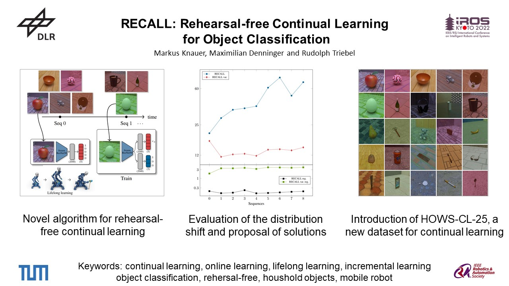
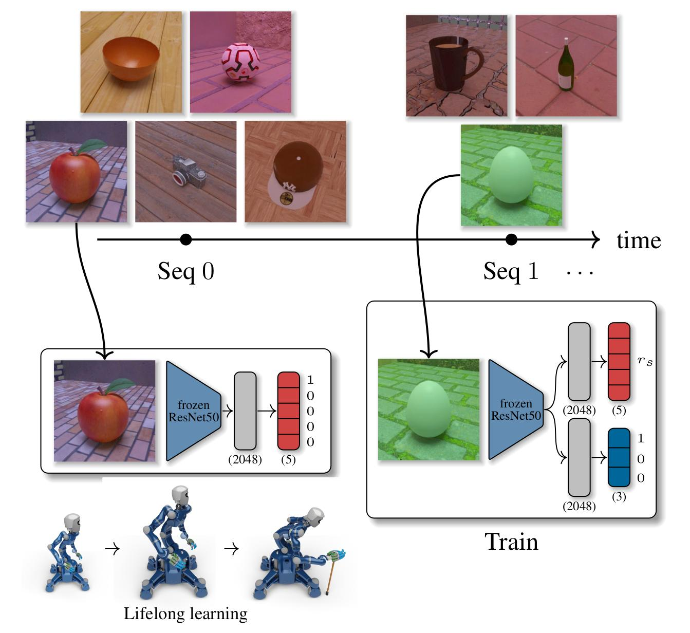
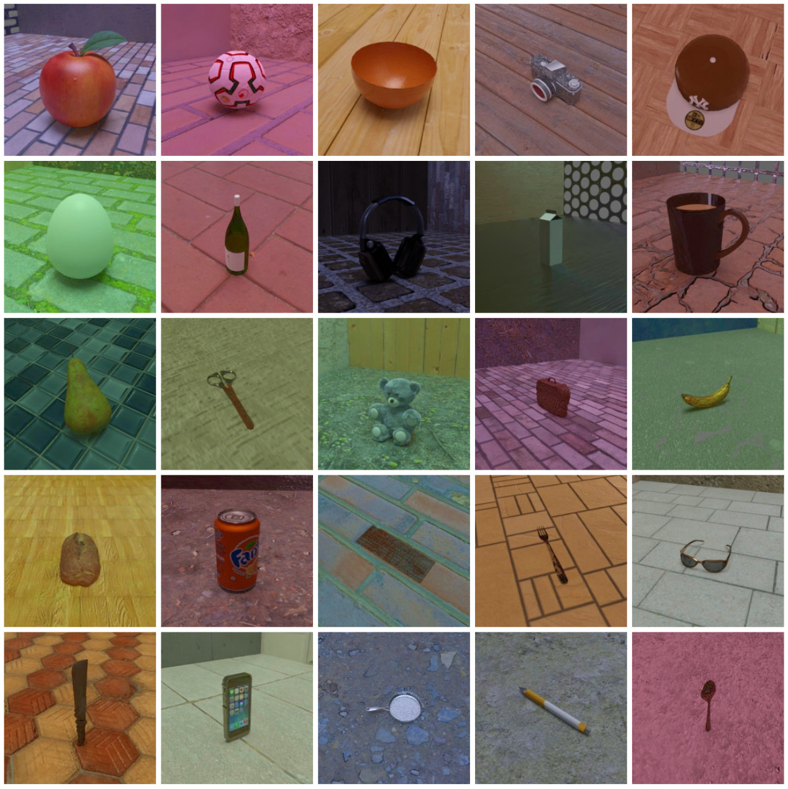

# RECALL and HOWS

[](https://opensource.org/licenses/MIT)

Author: Markus Knauer (markus.knauer@dlr.de),
Research Scientist @ German Aerospace Center (DLR), Institut of Robotics and Mechatronics, Munich, Germany &
Doctoral candidate @ Technical University Munich (TUM).

This repository contains the code of RECALL to reproduce the results from our IROS Paper.
As well as some code to download and use our new dataset HOWS.

[RECALL](#recall-rehearsal-free-continual-learning-for-object-classification) | [HOWS](#hows-houshold-objects-within-simulation-dataset) | [IROS paper](https://ieeexplore.ieee.org/document/9981968) | [Zenodo](https://zenodo.org/record/7189434) | [ArXiv paper](https://arxiv.org/abs/2209.14774) | [YouTube](https://youtu.be/P9buxiinVeI)

<div align="center">
  <a href="https://www.youtube.com/watch?v=P9buxiinVeI"></a>
</div>

## RECALL: Rehearsal-free Continual Learning for Object Classification
[Link to the IROS Paper](https://ieeexplore.ieee.org/document/9981968) | [Link to our Youtube Video](https://www.youtube.com/watch?v=P9buxiinVeI)

<div align="center">
  <a href="https://www.youtube.com/watch?v=P9buxiinVeI"></a>
</div>

This code is self-contained and should be able to run on any machine with enough memory.
We only tested this code on Ubuntu 20.04 (it will not work under Windows out of the box).

### Setup
The first step is to set up a new conda environment.
For that, you can use the existing `requirements.yaml` file:

```bash
conda env create --file requirements.yaml
```

After this you just have to activate the created environment:

```bash
conda activate recall_environment
```

This environment should already contain all needed packages.
If you didn't have installed conda on your machine yet please follow this [installation guide](https://docs.conda.io/projects/conda/en/latest/user-guide/install/linux.html).


### Get datasets

The second part is the download of the datasets (CORe50, HOWS and iCIFAR-100) and conversion of the images to Resnet50 features.
For that, we provide a script, which automatically downloads all needed files and unzips them automatically.
This also automatically downloads ResNet50 weights.
After that, all images are forwarded through a ResNet50 network and the resulting features are saved in several `TFRecordFiles`.

```bash
# Set the name of the folder for the HOWS, CORe50 and iCIFAR-100 datasets
export PATH_TO_DATASET="RECALL_datasets"  
#Download CORe50
python recall/data_import/data_generation_script.py --path_to_datasets $PATH_TO_DATASET --dataset_name "core50"
#Download iCIFAR-100
python recall/data_import/data_generation_script.py --path_to_datasets $PATH_TO_DATASET --dataset_name "icifar100"
#Download HOWS
python HOWS/download_hows_dataset.py --path_to_datasets $PATH_TO_DATASET --features --convert_to_tfrecord
```
Please note that this could take one hour. 
The generation of CORe50 features for example take about 35 minutes, as the CORe50 dataset has to be loaded 18 times to save the memory demand of the conversion.
Furthermore, we generate for each CORe50 image four different features, one original and three with random augmentations.
After this generation is done, you can start the training.

### Training

The training can be easily started with the following command:

```bash
#Start training of default RECALL with dataset CORe50 and record it for tensorboard
python recall.py --path_to_dataset $PATH_TO_DATASET --dataset_name DATASETNAME [-- options]
```
Here some examples:
#### Reproduce the results from RECALL on HOWS-CL-25 (five-sequence-version)
```bash
#Start training of default RECALL with dataset HOWS
python recall.py --path_to_dataset $PATH_TO_DATASET --dataset_name "hows"
#Start training of RECALL var. with dataset HOWS
python recall.py --path_to_dataset $PATH_TO_DATASET --dataset_name "hows" --use_divide_by_variance
#Start training of RECALL reg. with dataset HOWS
python recall.py --path_to_dataset $PATH_TO_DATASET --dataset_name "hows" --use_regression_loss
#Start training of RECALL var. reg. with dataset HOWS
python recall.py --path_to_dataset $PATH_TO_DATASET --dataset_name "hows" --use_divide_by_variance --use_regression_loss
``` 
#### Reproduce the results from RECALL on HOWS-CL-25 long (twelve-sequence-version)
```bash
#Start training of default RECALL with dataset HOWS long
python recall.py --path_to_dataset $PATH_TO_DATASET --dataset_name "hows_long"
#Start training of RECALL var. with dataset HOWS long
python recall.py --path_to_dataset $PATH_TO_DATASET --dataset_name "hows_long" --use_divide_by_variance
#Start training of RECALL reg. with dataset HOWS long
python recall.py --path_to_dataset $PATH_TO_DATASET --dataset_name "hows_long" --use_regression_loss
#Start training of RECALL var. reg. with dataset HOWS long
python recall.py --path_to_dataset $PATH_TO_DATASET --dataset_name "hows_long" --use_divide_by_variance --use_regression_loss
```
#### Reproduce the results from RECALL on CORe50
```bash
#Start training of default RECALL with dataset CORe50 and record it for tensorboard
python recall.py --path_to_dataset $PATH_TO_DATASET --dataset_name "core50" --record_tensorboard
```

#### Reproduce the results from RECALL on iCIFAR-100
```bash
#Start training of default RECALL with dataset iCIFAR-100
python recall.py --path_to_dataset $PATH_TO_DATASET --dataset_name "icifar100"
```

## HOWS: Houshold Objects within Simulation Dataset

[Download link to the dataset](https://zenodo.org/record/7189434)

<div align="center">
  <a href="https://zenodo.org/record/7189434"></a>
</div>

### Description:
HOWS contains 150795 RGB images containing 25 categories, over 925 instances of household objects, and corresponding normal, depth, and segmentation images.
The dataset was created using [Blenderproc](https://github.com/DLR-RM/BlenderProc).

#### The structure is as follows:
```
..
├── HOWS_CL_25
|    ├── images 
|    |   └── categories
|    |       └── objects (instances)     # One folder for each 3D object of the category
|    |           └── object              # Random modified object within random scenes
|    |               └── .hdf5 files     # Three images of random camera positions of the above object and scene in a .hdf5 format
|    |                                   # Each .hdf5 contains an RGB image and corresponding depth, segmentation, and normal image
|    └──  sequences
|         └──.txt files                 # Loading order seperated into training/validation and sequences for Continual Learning (CL)
|    
└── HOWS_CL_25_hdf5_features
    └── features_hdf5
        └── sequences                   # The four and twelve sequence versions of HOWS
            ├── training/validation     
                └── .hdf5 files         # The HOWS features saved as .hdf5 file, where "*_long_version" means the twelve-sequence version and the others the four sequence version of HOWS.
                                        # This also contains the collection.yaml for the four sequence version and collection_long_version.yaml for the twelve sequence version of HOWS. 
```
The folder "Images" contains the images organized according to the categories.
Here we ensured that there are about 6000 images per category.

The folder "Sequence" contains a structure in which the user can load the images (Continuous Learning CL) - but the dataset can also use for normal NN training.

The directory "HOWS_CL_25_hdf5_features" ONLY contains the features of HOWS, calculated by ResNet50 (K. He et al. 2016) and saved as a .hdf5 file. 

The `collection.yaml` contains information about the sequence in where it is saved.
For example in `/base/train/` (the first sequence) is contains the following information:
```yaml
classes:        # List of categories  [`/base/train` contains categories 0,1,2,3,4]
  0: 5250       # For each category the amount of pictures [There are 5250 images of category `0` in `/base/train`
  1: 5082
  ..
nr_classes: 5     # Number of categories
nr_images: 26649  # Number of images in total [`/base/train` contains 26649 images in total]
x.shape:          # The shape of the input x (images)
  - 224
  - 224
  - 3 
y.shape:          # The shape of the labels y [in this case 5 categories]
  - 5
```

## Dataset usage:

### Getting started
### 1. Download the dataset
Our HOWS dataset is hosted by [zenodo.org](https://zenodo.org/record/7189434). We provide the complete dataset
with all RGB-D, normal and segmentation images split into three .zip archives: "HOWS_CL_25.zip", "HOWS_CL_25.z01" and "HOWS_CL_25.z02", which is in total 123 GB.
And we also provide the calculated ResNet50-features of this dataset: "HOWS_CL_25_hdf5_features.zip", which is 3.5 GB. If you want to use the dataset for your machine learning approach or to run RECALL, we recommend only dowloading the features.
You can do so by executing the following command in your terminal or by downloading the features manually from zenodo.org:

```shell
# Set the name of the folder for the HOWS dataset
export PATH_TO_DATASET="RECALL_datasets" 
#Only downloading the features as .hdf file 
python HOWS/download_hows_dataset.py --path_to_datasets $PATH_TO_DATASET --features
```
For this, please first set up the conda environment, as described in ["Setup"](#setup).

If you want to download the complete HOWS-CL-25 dataset, we also provide a script.
This downloads the .zip parts, combines them, unzip and cleans up in order to have a HOWS_CL_25 directory with all the 
RGB-D, segmentation and normal images.
In order to download the whole dataset, you need at least 123 GB of free memory and a stable internet connection.

```shell
#Downloads the three .zip archives, combines them and unzip it --> Full dataset
python HOWS/download_hows_dataset.py --path_to_dataset $PATH_TO_DATASET --images
```
If that was successful you can continue reading at ["2. Dataset usage"](#2-datset-usage).

If you prefer to download our dataset yourself, you find at [zenodo.org](https://zenodo.org/record/7189434). 

You can also execute this in your terminal (linux):

```shell
#Please execute this inside the PATH_TO_DATASET folder
cd $PATH_TO_DATASET
#Only downloading the features as .hdf5 file 
curl https://zenodo.org/record/7189434/files/HOWS_CL_25_hdf5_features.zip --output HOWS_CL_25_hdf5_features.zip

#Downloading the full dataset
curl https://zenodo.org/record/7189434/files/HOWS_CL_25.zip --output HOWS_CL_25.zip
curl https://zenodo.org/record/7189434/files/HOWS_CL_25.z01 --output HOWS_CL_25.z01
curl https://zenodo.org/record/7189434/files/HOWS_CL_25.z02 --output HOWS_CL_25.z02
```

After downloading the full dataset, please note that we split this into three .zip files.

--> In order to open it correctly you have to download all three parts and double-click on one of them in you window manager.

If you are using a terminal, you have to merge the files into one .zip file before you can open it:

```shell
#Combine the split zip archives
zip -F HOWS_CL_25.zip --out HOWS_complete.zip

#Unzip them
unzip HOWS_complete.zip
```

### 2. Datset usage
For using this dataset for a machine learning / deep learning setup, we refer to the [RECALL chapter](#recall-rehearsal-free-continual-learning-for-object-classification).
Here you can skip the "Get datasets" part if you are only interested in HOWS.
This also includes an example for a HOWS feature loader.

We also provide a script to create your own image-loading order from HOWS in form of a .txt file: [HOWS/create_dataset_file.py](HOWS/create_dataset_file.py)

And finally, we also provide a loader for the HOWS images: [HOWS/hows_import.py](HOWS/hows_import.py)
Please note that this code will return the images and labels. To use them you have to adapt the code at the end to hand over the data to your approach or wherever you want to use them.
```bash
# Load RBG images for training of the first sequence of HOWS
python HOWS/hows_import.py --path_to_dataset $PATH_TO_DATASET --dataset_name hows --sequence base --mode train

# Load RGB images for validation of the second sequence of HOWS long
python HOWS/hows_import.py --path_to_dataset $PATH_TO_DATASET --dataset_name hows_long --sequence seq1 --mode validation
```

## Citation 

If you use RECALL or HOWS in a research project or publication, please cite as follows:

```
@article{knauer2022recall,
  title={RECALL: Rehearsal-free Continual Learning for Object Classification},
  author={Knauer, Markus and Denninger, Maximilian and Triebel, Rudolph},
  journal={IEEE/RSJ International Conference on Intelligent Robots and Systems (IROS)},
  doi={10.1109/IROS47612.2022.9981968}
  year={2022}
}
@dataset{knauer2022hows,
  title={HOWS-CL-25: Household Objects Within Simulation Dataset for Continual Learning},
  author={Knauer, Markus and Denninger, Maximilian and Triebel, Rudolph},
  publisher={Zenodo},
  year={2022}
  doi={10.5281/zenodo.7189434}
  url={https://doi.org/10.5281/zenodo.7189434
}
```

---

<div align="center">
  <a href="https://www.dlr.de/EN/Home/home_node.html"></a>
</div>
